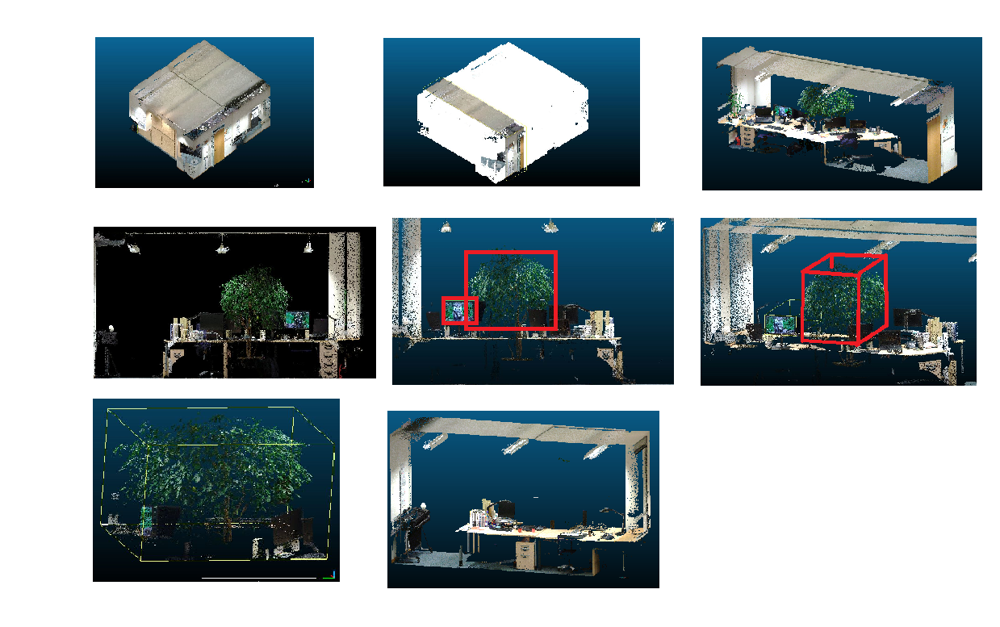
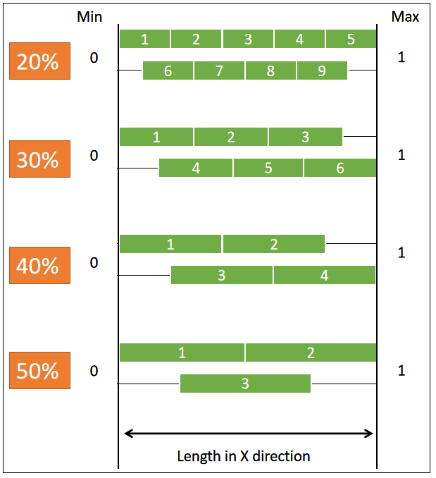
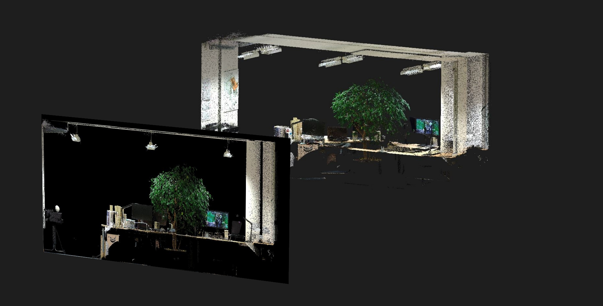
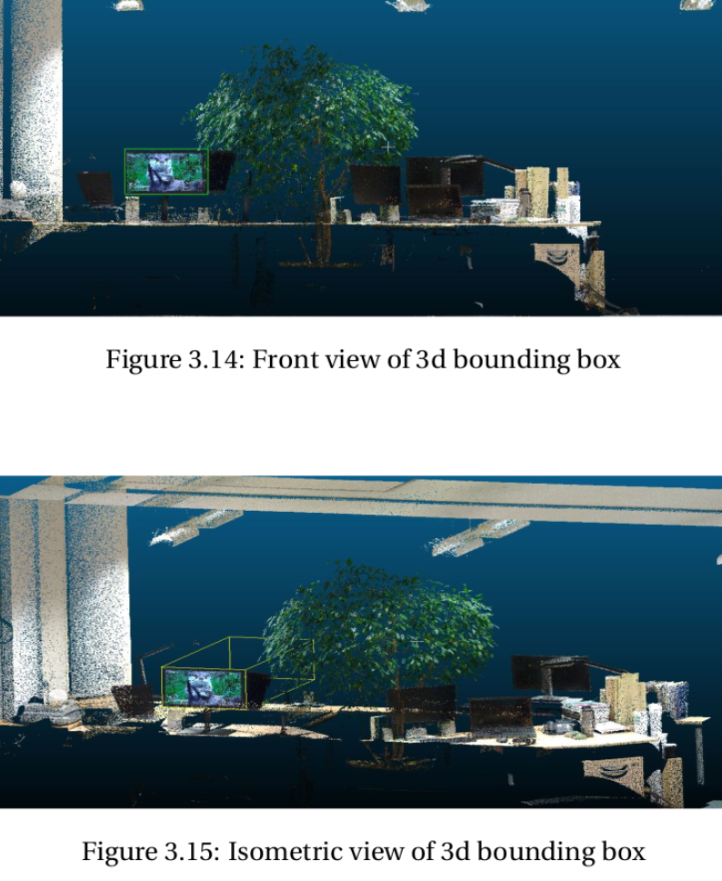

# Automated Transformation of a point cloud to 3D object

*Visualization of pipeline of slicing and object detection*
*Visualisation of various slice sizes with respect to the longest side/length of the Office scene point cloud*
*How a 3d point cloud is sliced and projected to create a 2d Image*
*Visualisation of object detected in 2d image and display on point cloud slice*
*Displaying the isolated point cloud of the object detected*
*Displaying the isolated point cloud of the object detected*

## Briefly about the project
In this project I have explored the technique of slicing and projecting the point cloud to form a 2D image to use a state-of-the-art 2D image detection technique to extract information about the ’position’ and ’identity’ of the objects in point cloud scene, with least amount of user intervention.

## How to navigate this repository 
### Input
The inputs are point cloud files of format .pcd of indoor office spaces.   

### Output
- The output of the pipeline is the CAD objects of the office room and the objects identified and seperated from the office room. 
- A list of uniquely identified objects from the scene and confidence score of the algorithm regarding the identity of the respective objects.
- Point clouds of the objects identified and isolated from the scene. 

### Project report
The final report of the project is extremely comprehensive and detailed. Chapter 3 consists of detailed description of the project pipeline and each step in the pipeline. It is a good place to start to understand and replicate this research.

## How to replicate this research
Obtain all the code files in the code folder. The main.py is initiation file, every step of the pipeline is linked and called to the main.py.  

